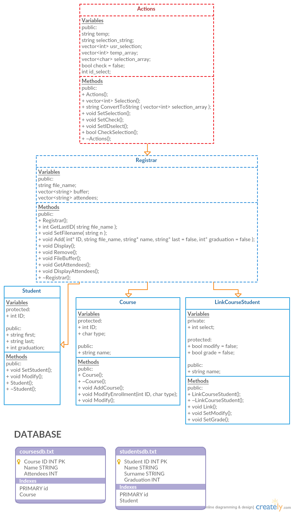

## Welcome to GitHub Pages

## C++ console application, Student Desk simulation

Uses .txt database to store data for students and courses, created with relation principle in mind.

Uses inherited structure from actions as base class.

Detailed description will be added later.....

